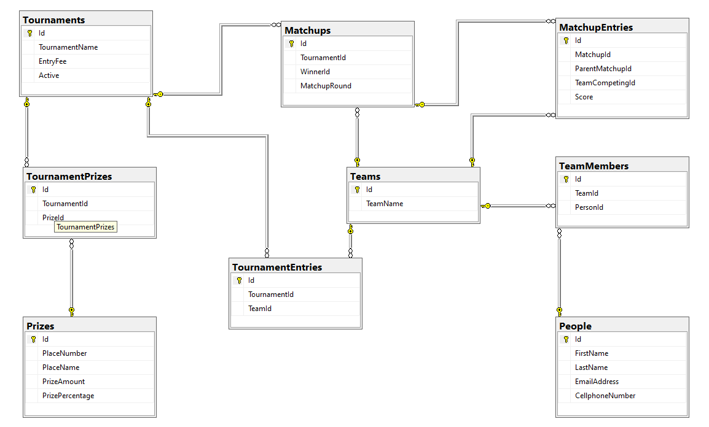

# Tournament Tracker

Tournament Tracker is a WinForms application that allows users to create and play through elimination-style tournaments.

It allows users to create team members, teams, prizes, and then proceeds to randomize the rounds and matchups to create a tournament. If there is an odd number of teams, a randomly chosen team will be automatically transferred to the next round. After the final match had completed, a winner was declared and the prizes were distributed.

Featured technologies used include:
 - Class Libraries
 - Interfaces
 - Custom Events
 - Email (players receive e-mail notifications)
 - SQL
 - Text Files
 - App.config data storage and retrieval
 - OOP

## Database diagram

    

## Demo Video

    

